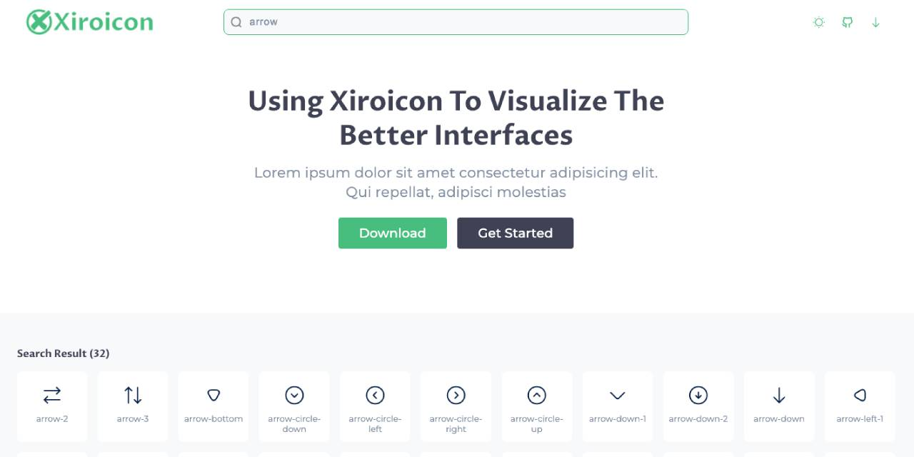

 &nbsp;  &nbsp; 

Xiroicon is a set of open-source icon package for designers and develoeprs. 
[](https://xirosoft.github.io/xiroicon)
Explore our full icon set at [https://xirosoft.github.io/xiroicon](https://xirosoft.github.io/xiroicon).

## Usage 
### Basic Usage

Just click the icons you want from [https://xirosoft.github.io/xiroicon](https://xirosoft.github.io/xiroicon), and then you can download the icons in SVG or PNG format.

Designers can click the `Copy SVG` button and then press `⌘+V` or `Ctrl+V` to paste the vector graphic into your design tool directly, easy and simple.

> We recommend that designers download or copy icons from our website when needed instead of managing all of them in a local folder. The website's search engine allows you to quickly locate the icon you are looking for and the icons on the website are being continuously updated.
>
> The `Copy Icon` now supports Sketch, Figma, Adobe XD, Adobe Illustrator, Affinity Designer, Affinity Photo, etc.

### Webfont Usage

> **Note:** You can import **Xiroicon** cdn or download it manually.

#### CDN

Copy the following code and add it to the &lt;head&gt; tag of your html document.

```html
<link href="https://cdn.jsdelivr.net/npm/remixicon@3.2.0/fonts/remixicon.css" rel="stylesheet">
```

#### Download Manually

Download [`xiroicon.css`](https://xirosoft.github.io/xiroicon/icon/xiroicon.min.css) file, add it to the &lt;head&gt; tag of your html document.

#### Use

Add icon with class name, class name rule: xiroicon xi-{name}

```html
<i class="xiroicon xi-arrow"></i>
<i class="xiroicon xi-arrow-left"></i>
```


## Contributing

> **Note:** If you want to contribute an icon to XiroIcon, you can create an [issue](https://github.com/xirosoft/xiroicon/issues) with a screenshot or url to your svg-format file. If you are not familiar with github, you can also email us directly `xiroicon@xirosoft.com`.

### Icon Request

If there is no suitable icon for your usage scenario, you can create an [issue](https://github.com/xirosoft/xiroicon/issues) with a title of "Icon request: `<Icon name>`" and fill the issue template.

## License

XiroIcon is based on the [Apache License Version 2.0](https://github.com/Xirosoft/xiroicon/blob/master/License) license.  Feel free to use these icons in your products and distribute them.

## Support Us

It's simple and easy. Just star our project and recommend it to your friends. Your encouragement is the greatest fuel to drive us forward.
